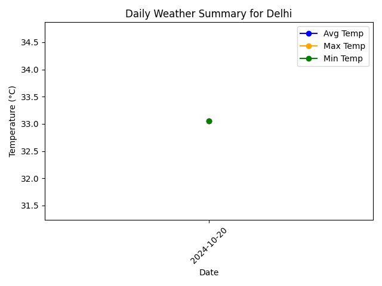
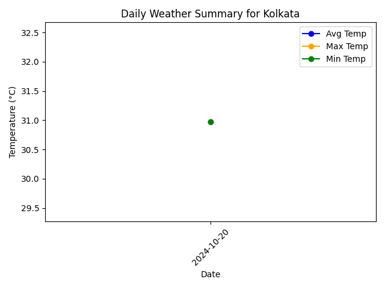
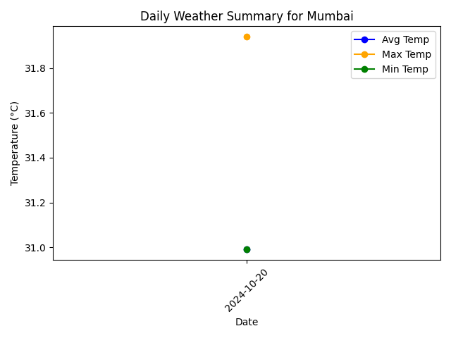

# Weather Data Monitoring Application

This project retrieves real-time weather data from the OpenWeatherMap API for multiple cities and stores it in an SQLite database. The application processes the data to generate daily summaries and visualizations that highlight trends in temperature and weather conditions.

## Screenshots

### 1. Bangalore Weather Summary

### 2. Chennai Weather Summary

### 3. Delhi Weather Summary

### 4. Hyderabad Weather Summary

### 5. Kolkata Weather Summary

### 6. Mumbai Weather Summary

### 7. Overall Weather Summary

## Conclusion

This project showcases how real-time weather data can be fetched, stored, and visualized using Python. The data is stored in an SQLite database and analyzed to highlight temperature trends and weather conditions across multiple cities. By providing city-specific visualizations along with an overall comparison, it serves as a useful tool for weather data analysis.

## License

This project is licensed under the MIT License. See the [LICENSE](LICENSE) file for details.
