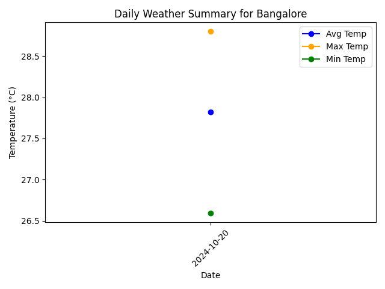

# Weather Data Monitoring Application

This project retrieves real-time weather data from the OpenWeatherMap API for multiple cities and stores it in an SQLite database. The application processes the data to generate daily summaries and visualizations that highlight trends in temperature and weather conditions.

## Features
- **Fetch Real-Time Weather Data**: Retrieves weather data using the OpenWeatherMap API.
- **Store Data in SQLite**: Saves the weather data locally for further processing.
- **Generate City-Specific Visualizations**: Visualizes temperature data for individual cities.
- **Overall Comparison**: Provides an overall comparison of weather data across all cities.

## Technologies Used
- **Python 3.12**: Backend processing and weather data retrieval.
- **SQLite**: Database to store weather data.
- **Matplotlib**: For generating visualizations.
- **Requests**: To fetch data from the OpenWeatherMap API.

## Setup and Installation

### Prerequisites
1. Python 3.x
2. `pip` for installing dependencies

### Installation Steps
1. Clone the repository:
    ```bash
    git clone https://github.com/Gokuluvarajofficial/WeatherAppProject.git
    cd WeatherAppProject
    ```
2. Create a virtual environment and activate it:
    ```bash
    python -m venv venv
    source venv/bin/activate   # On Windows: venv\Scripts\activate
    ```
3. Install the required dependencies:
    ```bash
    pip install -r requirements.txt
    ```

### Step 1: Fetch the Weather Data
To fetch weather data for the cities and store it in the SQLite database, run the following command:
```bash
python src/real_time_weather.py

## Screenshots

### 1. Bangalore Weather Summary


### 2. Chennai Weather Summary


### 3. Delhi Weather Summary


### 4. Hyderabad Weather Summary


### 5. Kolkata Weather Summary


### 6. Mumbai Weather Summary


### 7. Overall Weather Summary


## Conclusion

This project showcases how real-time weather data can be fetched, stored, and visualized using Python. The data is stored in an SQLite database and analyzed to highlight temperature trends and weather conditions across multiple cities. By providing city-specific visualizations along with an overall comparison, it serves as a useful tool for weather data analysis.

## License

This project is licensed under the MIT License. See the [LICENSE](LICENSE) file for details.
